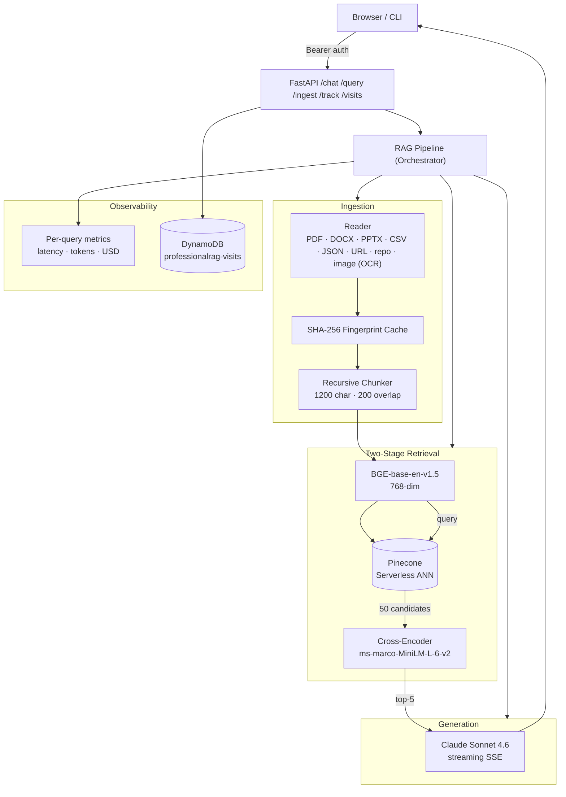

# ProfessionalRAG

> Production-grade Retrieval-Augmented Generation pipeline with two-stage retrieval, LLM-as-judge evaluation, per-query cost telemetry, and a streaming chat API — built from scratch, no LangChain or LlamaIndex.

**Live demo:** [vikhyatchauhan.com/chat](https://vikhyatchauhan.com/chat)


---

## Architecture



**Pattern:** retrieve 50 candidates via ANN → rerank with a cross-encoder → ground Claude on the top-5 → stream tokens over SSE. Same shape used in production search at Google, Bing, and Cohere.

---

## Quick Start (≤ 60 seconds)

```bash
git clone https://github.com/vikhyatchauhan/ProfessionalRAG && cd ProfessionalRAG
python -m venv venv && source venv/bin/activate
pip install -r requirements.txt
cp .env.example .env   # add ANTHROPIC_API_KEY, PINECONE_API_KEY, ProfessionalRAG_KEY

python cli.py ingest README.md           # ingest anything: pdf, docx, url, repo
python cli.py query "what does this repo do?"
python cli.py serve                      # FastAPI on :8080
```

**Run the test suite:**
```bash
pip install -r requirements-dev.txt && pytest      # 18 tests, ~3s, no network
```

**Deploy to EC2:**
```bash
docker build -t professional-rag .
docker run -d -p 8080:8080 --env-file .env professional-rag
# IAM role on the EC2 instance needs: dynamodb:CreateTable, PutItem, Scan, ListTables
```

---

## Results

Measured over 10 production queries against a 5,144-chunk PDF corpus (`metrics_log.jsonl`):

| Metric | Median | Mean | Notes |
|---|---:|---:|---|
| Total latency | **9.3 s** | 12.1 s | end-to-end, including LLM generation |
| Retrieval (ANN) | **270 ms** | 462 ms | 50 candidates from Pinecone |
| Reranking | **2.0 s** | 6.0 s | cross-encoder on 50×query pairs |
| Cost per query | **$0.006** | $0.005 | Sonnet 4.6 at $3/$15 per M tokens |
| Input tokens | 545 | 603 | grounded context (top-5 chunks) |
| Output tokens | 257 | 226 | answer + citations |
| Test suite | — | **3.3 s** | 18 tests, 0 network calls |
| Container cold start | — | **~5 s** | models pre-baked into image (~500 MB) |

**Why these matter:**
- Two-stage retrieval keeps the LLM context small (~600 input tokens) — most of the cost stays in retrieval, not generation.
- Reranking is the dominant latency cost; swapping to a smaller cross-encoder or a GPU is the obvious next lever.
- Streaming chat (SSE) means perceived latency for the user is **time-to-first-token**, not total — Claude starts emitting after retrieval+rerank (~2.3 s median).

---

## API

| Endpoint | Method | Purpose |
|---|---|---|
| `/health` | `GET` | Liveness + corpus size (unauthenticated) |
| `/ingest` | `POST` | Ingest one or many sources with SHA-256 dedup |
| `/query` | `POST` | Full retrieve → rerank → generate, JSON response |
| `/chat` | `POST` | Same pipeline, streaming SSE (`sources` → `token`* → `done`) |
| `/evaluate` | `POST` | Golden-dataset eval (Hit@K, MRR, LLM-as-judge) |
| `/metrics` | `GET` | Aggregated per-query stats |
| `/track` | `POST` | Record a visit event (pageview, tab click, outbound, chat, time-on-site) |
| `/visits` | `GET` | Visit analytics — uniques, daily time-series, bounce rate, source/page/referrer/UTM/device breakdowns, time-on-site percentiles |
| `/dashboard` | `GET` | Self-contained Chart.js dashboard for the `/visits` data (no build step) |

All endpoints except `/health` and `/dashboard` require `Authorization: Bearer $ProfessionalRAG_KEY`. The app **fails closed at boot** if the key isn't set — no silent open-API state. (`/dashboard` serves only static HTML/JS; the in-page fetch to `/visits` still requires the key, which the page prompts for and keeps in `localStorage`.)

### Visit analytics

`GET /visits` accepts either a relative window or an explicit range:

| Param | Default | Notes |
|---|---|---|
| `days` | `30` | Relative window, 1–365 |
| `start` / `end` | — | `YYYY-MM-DD`, inclusive; both required together, ≤ 366 days apart |
| `source` | — | Filter pageview attribution to one source |

The response adds `unique_visitors`, `bounce_rate`, `by_day` (per-day pageviews + uniques for charting), `by_referrer` / `by_utm_medium` / `by_utm_campaign` / `by_language` / `by_theme`, and `time_on_site` (`avg` / `p50` / `p90` / `p95`) on top of the original breakdowns.

**Unique visitors** are counted via a daily-rotating `sha256(salt + UTC date + IP + user-agent)` hash — no cookies, no raw-IP storage, non-reversible (the technique Plausible uses). Per-day uniques are exact; because the salt rotates daily, a visitor spanning multiple days is counted once per day. The salt comes from `VISIT_SALT` (falls back to `ProfessionalRAG_KEY` if unset).

---

## Project Layout

```
api/server.py            FastAPI app · auth middleware · rate limits · SSE streaming
pipeline.py              Orchestrator: ingest → retrieve → rerank → generate → evaluate
ingestion/               Multi-format reader (PDF, DOCX, PPTX, CSV, JSON, URL, repo, image)
retrieval/               BGE embedder · Pinecone store · MS-MARCO cross-encoder
generation/llm.py        Claude client with grounded system prompt + token tracking
evaluation/              Hit@K / MRR + LLM-as-judge (faithfulness, completeness, conciseness)
monitoring/metrics.py    Per-query latency + token + USD telemetry to JSONL
monitoring/visits.py     DynamoDB-backed event storage + daily-rotating visitor hash
monitoring/analytics.py  Pure aggregation: uniques, by-day series, bounce, percentiles
tests/                   pytest suite · stubs all externals · no network · runs in ~3s
Dockerfile               python:3.12-slim · models pre-baked · HEALTHCHECK on /health
```

---

## Configuration

Environment-driven via Pydantic Settings (loads `.env`):

| Variable | Default | Required |
|---|---|---|
| `ANTHROPIC_API_KEY` | — | ✓ |
| `PINECONE_API_KEY` | — | ✓ |
| `ProfessionalRAG_KEY` | — | ✓ (app refuses to start without it) |
| `VISIT_SALT` | falls back to `ProfessionalRAG_KEY` | (analytics visitor-hash salt) |
| `PINECONE_INDEX` | `professional-rag` | |
| `LLM_MODEL` | `claude-sonnet-4-6` | |
| `EMBEDDING_MODEL` | `BAAI/bge-base-en-v1.5` | |
| `RERANKER_MODEL` | `cross-encoder/ms-marco-MiniLM-L-6-v2` | |
| `CHUNK_SIZE` / `CHUNK_OVERLAP` | `1200` / `200` | |
| `CANDIDATE_COUNT` / `TOP_K` | `50` / `5` | |

On EC2 the AWS region is hard-coded to `us-east-1`; the instance needs an IAM role with DynamoDB permissions for the `professionalrag-visits` table.

---

## What I Learned

- **Two-stage retrieval is mostly a latency story, not a quality story.** Reranking dominates the request budget (median 2 s of a 9.3 s total). The real win was keeping LLM context tight (~600 input tokens) — generation cost stays predictable even as the corpus grows past 5k chunks.
- **Fail closed, not open.** The original auth middleware silently disabled itself when `ProfessionalRAG_KEY` was missing. Replacing that with a startup-time `RuntimeError` turned a latent security hole into a loud, obvious deployment failure — the kind of bug you want to hit in `docker run`, not in production.
- **Migrating storage layers exposes hidden coupling.** Moving visit analytics from Firestore to DynamoDB looked like a one-file change until the `/visits` handler turned out to still be calling `.where().stream().to_dict()` on what was now a plain list. A small test suite that exercises every endpoint with stubbed externals (3 s, no AWS creds) catches this class of half-migration immediately.

---

## License

MIT
